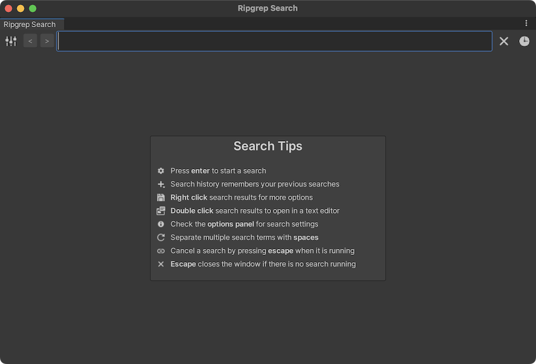
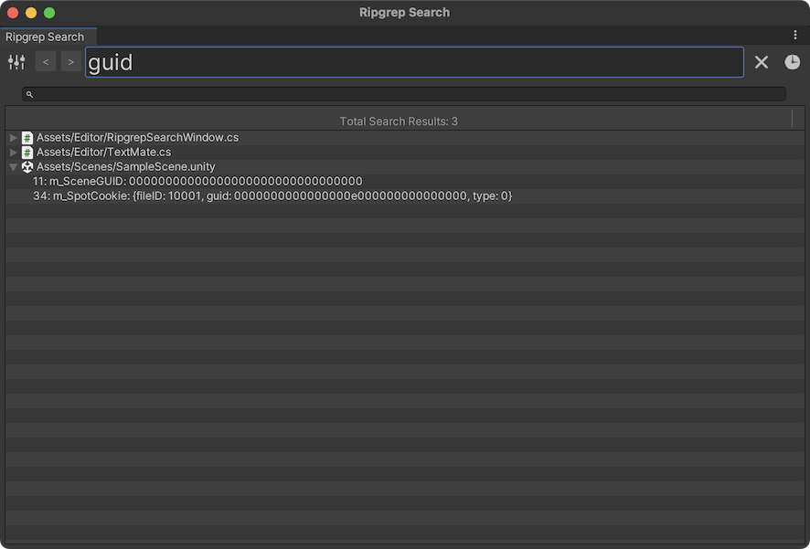
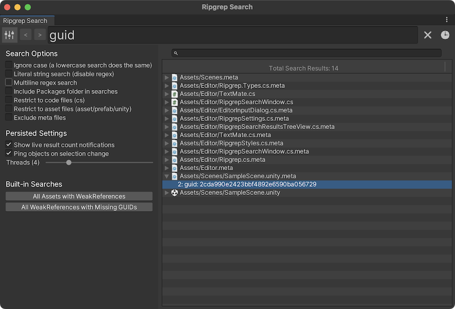

# Unity Ripgrep Search Tool

Helper class for making your own search tools along with a built-in transient Ripgrep search window.

### Features
- uses the fantastic `ripgrep` to search your Unity code, assets, prefabs and scene files
- handy search window with multithreaded dispatch and parsing of ripgrep search results
- advanced Unity users (those who know scene/asset/prefab file internals and basic regex) can find pretty much anything _fast_
- find references to anything by just searching the GUID
- save commonly used searches
- optionally add any paths you want searched for code/files that live outside of the Unity world

### Requirements
- install [https://github.com/BurntSushi/ripgrep](ripgrep) (make sure it's on your path for Windows and available from `/usr/local/bin/rg` for macOS)
- Unity LTS release (not tested on anything that isn't an LTS because I'm not insane enough to use one)

### Usage
- `cmd/ctrl + G` opens the search window
- type at least 3 letters and press enter
- escape stops the search if it is active or closes the search window if it is complete
- results will ping on click and open to the search result line in TextMate on double-click (if on macOS with TextMate installed)

### Images

